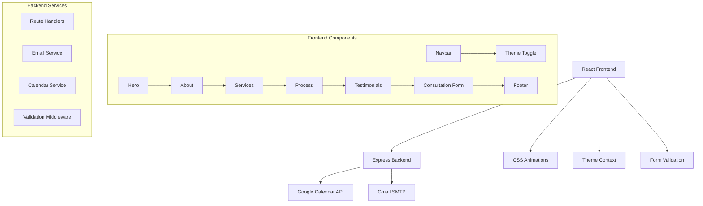

# UKuniadvisor - UK Education Consultancy Website

[](https://reactjs.org/)
[](https://nodejs.org/)
[](LICENSE)
[]()

A modern, fully responsive single-page website for UK education consultancy services, featuring advanced consultation booking with Google Calendar integration, automated email notifications, dark/light theme support, and comprehensive mobile-first design.

## 📋 Table of Contents

- [🌟 Features](#-features)
- [🚀 Live Demo](#-live-demo)
- [🏗️ Architecture](#️-architecture)
- [📋 Prerequisites](#-prerequisites)
- [⚡ Quick Start](#-quick-start)
- [🔧 Detailed Setup](#-detailed-setup)
- [📁 Project Structure](#-project-structure)
- [🎨 Design System](#-design-system)
- [📱 Components Overview](#-components-overview)
- [🔌 API Documentation](#-api-documentation)
- [🚀 Deployment](#-deployment)
- [🧪 Testing](#-testing)
- [🛠️ Development Workflow](#️-development-workflow)
- [🎯 Performance Optimization](#-performance-optimization)
- [🔐 Security](#-security)
- [🌍 Browser Support](#-browser-support)
- [📱 Mobile Responsiveness](#-mobile-responsiveness)
- [🐛 Troubleshooting](#-troubleshooting)
- [🤝 Contributing](#-contributing)
- [📄 License](#-license)
- [📞 Support](#-support)

## 🌟 Features

### 🎨 **Modern User Interface**
- **Responsive Design**: Mobile-first approach with breakpoints at 480px, 768px, and 1024px
- **Dark/Light Theme**: Toggle between themes with persistent localStorage preferences
- **Smooth Animations**: CSS transitions and keyframe animations for enhanced UX
- **Glass Morphism**: Modern glass effects with backdrop filters
- **Professional Color Scheme**: Navy blue, sage green, and gold palette

### 🚀 **Advanced Functionality**
- **Real-time Consultation Booking**: Integrated Google Calendar API for scheduling
- **Email Automation**: Automated confirmation emails via Nodemailer
- **Form Validation**: Client-side and server-side input validation
- **Smooth Scrolling**: Animated section navigation
- **Performance Optimized**: Lazy loading and optimized assets

### 📱 **Mobile Excellence**
- **Touch-Friendly**: Optimized touch interactions and gestures
- **Progressive Web App Ready**: Offline capabilities and app-like experience
- **Fast Loading**: Optimized for mobile networks
- **Responsive Navigation**: Collapsible mobile menu with animations

### 🔧 **Developer Experience**
- **Modern React**: Hooks, functional components, and latest React patterns
- **Clean Code**: ESLint configuration and consistent formatting
- **Modular Architecture**: Reusable components and contexts
- **Environment Configuration**: Flexible env-based setup

## 🚀 Live Demo

🔗 **[View Live Website](https://ukuniadvisor.netlify.app)**

## 🏗️ Architecture



## 📋 Prerequisites

Before you begin, ensure you have the following installed and configured:

### 🖥️ **System Requirements**
- **Node.js**: v16.0.0 or higher
- **npm**: v7.0.0 or higher (or yarn v1.22.0+)
- **Git**: v2.0.0 or higher

### 🔑 **API Access Requirements**
- **Google Cloud Console Account**: For Calendar API access
- **Gmail Account**: With 2FA enabled for app passwords
- **Domain Access**: For production deployment (optional)

### 🌐 **Browser Compatibility**
- Chrome 90+
- Firefox 88+
- Safari 14+
- Edge 90+

## ⚡ Quick Start

Get up and running in 5 minutes:

```bash
# 1. Clone the repository
git clone https://github.com/your-username/ukuniadvisor-website.git
cd ukuniadvisor-website

# 2. Install dependencies
npm install

# 3. Set up environment variables
cp env.example .env
# Edit .env with your configuration

# 4. Start development server
npm run dev
```

🎉 **That's it!** Your application will be running at:
- **Frontend**: http://localhost:3000
- **Backend**: http://localhost:5000

## 🔧 Detailed Setup

### 1. **Environment Configuration**

Create a `.env` file in the root directory:

```env
# Google Calendar API Configuration
GOOGLE_CLIENT_ID=your_google_client_id_here
GOOGLE_CLIENT_SECRET=your_google_client_secret_here
GOOGLE_REDIRECT_URL=http://localhost:5000/auth/google/callback
GOOGLE_REFRESH_TOKEN=your_google_refresh_token_here

# Email Configuration
EMAIL_USER=your_gmail_address@gmail.com
EMAIL_PASS=your_gmail_app_password_here

# Consultant Configuration
CONSULTANT_EMAIL=consultant@ukuniadvisor.com
CONSULTANT_NAME=Your Name
CONSULTANT_PHONE=+1-234-567-8900

# Server Configuration
PORT=5000
NODE_ENV=development
CORS_ORIGIN=http://localhost:3000

# Optional: Analytics
GOOGLE_ANALYTICS_ID=GA_MEASUREMENT_ID
```

### 2. **Google Calendar API Setup**

#### Step-by-Step Guide:

1. **Create Google Cloud Project**
   ```bash
   # Visit Google Cloud Console
   https://console.cloud.google.com
   ```

2. **Enable Calendar API**
   - Navigate to "APIs & Services" > "Library"
   - Search for "Google Calendar API"
   - Click "Enable"

3. **Create Credentials**
   - Go to "APIs & Services" > "Credentials"
   - Click "Create Credentials" > "OAuth 2.0 Client ID"
   - Choose "Web application"
   - Add authorized redirect URIs:
     - `http://localhost:5000/auth/google/callback` (development)
     - `https://yourdomain.com/auth/google/callback` (production)

4. **Generate Refresh Token**
   ```bash
   # Use Google OAuth 2.0 Playground
   https://developers.google.com/oauthplayground/
   
   # Steps:
   # 1. Select "Google Calendar API v3"
   # 2. Authorize APIs
   # 3. Exchange authorization code for tokens
   # 4. Copy the refresh_token
   ```

### 3. **Gmail App Password Setup**

1. **Enable 2-Factor Authentication**
   - Go to Google Account settings
   - Security > 2-Step Verification > Turn on

2. **Generate App Password**
   - Security > App passwords
   - Select app: "Mail"
   - Select device: "Other (custom name)"
   - Enter: "UKuniadvisor Website"
   - Copy the generated 16-character password

3. **Update Environment Variables**
   ```env
   EMAIL_USER=your_gmail@gmail.com
   EMAIL_PASS=your_16_character_app_password
   ```

## 📁 Project Structure

```
ukuniadvisor-website/
├── 📁 public/                    # Static assets
│   ├── index.html               # Main HTML template
│   ├── favicon.ico             # Site favicon
│   ├── manifest.json           # PWA manifest
│   └── robots.txt              # SEO robots file
├── 📁 src/                      # Source code
│   ├── 📁 components/           # React components
│   │   ├── Navbar.js           # Navigation component
│   │   ├── Hero.js             # Landing section
│   │   ├── About.js            # About section
│   │   ├── Services.js         # Services showcase
│   │   ├── TrustFactors.js     # Trust indicators
│   │   ├── Process.js          # Consultation process
│   │   ├── Testimonials.js     # Client testimonials
│   │   ├── ConsultationForm.js # Booking form
│   │   ├── Footer.js           # Footer component
│   │   ├── ThemeToggle.js      # Dark/light theme toggle
│   │   └── WaterBackground.js  # Animated background
│   ├── 📁 contexts/             # React contexts
│   │   └── ThemeContext.js     # Theme management
│   ├── App.js                  # Main app component
│   ├── App.css                 # Global styles (2800+ lines)
│   ├── index.js                # React entry point
│   └── index.css               # Base styles
├── 📄 server.js                 # Express backend
├── 📄 package.json              # Dependencies & scripts
├── 📄 env.example               # Environment template
├── 📄 .gitignore               # Git ignore rules
└── 📄 README.md                # This documentation
```

## 🎨 Design System

### 🎨 **Color Palette**

```css
/* Primary Colors */
--primary-navy: #1e3a8a;        /* Main brand color */
--accent-navy: #1e40af;         /* Hover states */
--primary-sage: #8bb88b;        /* Accent green */
--accent-sage: #7aa37a;         /* Darker green */

/* Neutral Colors */
--white: #ffffff;               /* Pure white */
--pure-white: #ffffff;          /* Explicit white */
--light-gray: #f8fafc;          /* Light backgrounds */
--gray: #64748b;                /* Text secondary */
--dark-gray: #334155;           /* Text primary */
--primary-black: #000000;       /* Pure black */
--secondary-black: #1a1a1a;     /* Dark theme bg */

/* Glass Effects */
--glass-white: rgba(255, 255, 255, 0.1);
--glass-white-strong: rgba(255, 255, 255, 0.95);
--glass-black-strong: rgba(0, 0, 0, 0.8);
--backdrop-blur: blur(20px);
--backdrop-blur-strong: blur(40px);
```

### 📝 **Typography**

```css
/* Font Family */
font-family: 'Poppins', -apple-system, BlinkMacSystemFont, sans-serif;

/* Font Weights */
--font-thin: 300;
--font-regular: 400;
--font-medium: 500;
--font-semibold: 600;
--font-bold: 700;
--font-extrabold: 800;

/* Font Sizes */
--text-xs: 0.75rem;    /* 12px */
--text-sm: 0.875rem;   /* 14px */
--text-base: 1rem;     /* 16px */
--text-lg: 1.125rem;   /* 18px */
--text-xl: 1.25rem;    /* 20px */
--text-2xl: 1.5rem;    /* 24px */
--text-3xl: 1.875rem;  /* 30px */
--text-4xl: 2.25rem;   /* 36px */
```

### 📏 **Spacing System**

```css
/* Spacing Scale (based on 4px grid) */
--space-1: 0.25rem;   /* 4px */
--space-2: 0.5rem;    /* 8px */
--space-3: 0.75rem;   /* 12px */
--space-4: 1rem;      /* 16px */
--space-5: 1.25rem;   /* 20px */
--space-6: 1.5rem;    /* 24px */
--space-8: 2rem;      /* 32px */
--space-10: 2.5rem;   /* 40px */
--space-12: 3rem;     /* 48px */
--space-16: 4rem;     /* 64px */
--space-20: 5rem;     /* 80px */
--space-24: 6rem;     /* 96px */
```

### 📱 **Responsive Breakpoints**

```css
/* Mobile First Approach */
@media (max-width: 480px)  { /* Mobile */ }
@media (max-width: 768px)  { /* Tablet */ }
@media (max-width: 1024px) { /* Desktop */ }
@media (max-width: 1280px) { /* Large Desktop */ }
```

## 📱 Components Overview

### 🧭 **Navbar Component**
- **Responsive Navigation**: Collapsible mobile menu
- **Smooth Scrolling**: Animated section navigation
- **Theme Toggle**: Dark/light mode switcher
- **Scroll Detection**: Changes appearance on scroll
- **Mobile Optimized**: Touch-friendly hamburger menu

**Key Features:**
```javascript
// State management
const [isScrolled, setIsScrolled] = useState(false);
const [isMobileMenuOpen, setIsMobileMenuOpen] = useState(false);

// Smooth scrolling
const scrollToSection = (sectionId) => {
  const element = document.getElementById(sectionId);
  if (element) {
    element.scrollIntoView({ behavior: "smooth" });
  }
};
```

### 🌟 **Hero Component**
- **Dynamic Animations**: Fade-in effects on load
- **Responsive Layout**: Grid-based design
- **Call-to-Action**: Primary and secondary buttons
- **Background Effects**: Animated water background integration

### 💼 **Services Component**
- **Service Cards**: Interactive hover effects
- **Feature Lists**: Detailed service descriptions
- **Responsive Grid**: Adapts to screen size
- **Visual Icons**: Custom iconography

### 📝 **ConsultationForm Component**
- **Real-time Validation**: Input validation with error messages
- **Google Calendar Integration**: Automatic event creation
- **Email Notifications**: Confirmation emails
- **Multi-step Process**: Form submission handling

**Form Fields:**
```javascript
const formData = {
  name: String,
  email: String,
  phone: String,
  preferredDate: Date,
  preferredTime: String,
  areaOfInterest: String,
  message: String (optional)
};
```

### 🎨 **ThemeToggle Component**
- **Persistent Storage**: localStorage theme preference
- **Smooth Transitions**: CSS transitions for theme changes
- **System Preference**: Respects OS dark mode preference
- **Accessibility**: ARIA labels and keyboard navigation

```javascript
// Theme context usage
const { theme, toggleTheme } = useContext(ThemeContext);

// Theme persistence
useEffect(() => {
  localStorage.setItem('theme', theme);
  document.documentElement.className = theme;
}, [theme]);
```

## 🔌 API Documentation

### **Consultation Booking API**

#### `POST /api/book-consultation`

Books a consultation and creates a Google Calendar event.

**Request Headers:**
```
Content-Type: application/json
```

**Request Body:**
```json
{
  "name": "John Doe",
  "email": "john.doe@email.com",
  "phone": "+1-234-567-8900",
  "preferredDate": "2024-02-15",
  "preferredTime": "2:00 PM - 3:00 PM",
  "areaOfInterest": "Postgraduate Courses",
  "message": "Looking for MBA programs in London"
}
```

**Success Response (200):**
```json
{
  "success": true,
  "message": "Consultation booked successfully!",
  "data": {
    "eventId": "google_calendar_event_id",
    "confirmationNumber": "CONF-123456",
    "scheduledDateTime": "2024-02-15T14:00:00Z"
  }
}
```

**Error Response (400):**
```json
{
  "success": false,
  "message": "Validation failed",
  "errors": [
    {
      "field": "email",
      "message": "Please provide a valid email address"
    }
  ]
}
```

**Error Response (500):**
```json
{
  "success": false,
  "message": "Server error occurred",
  "error": "Internal server error"
}
```

### **Health Check API**

#### `GET /api/health`

Returns server health status.

**Response (200):**
```json
{
  "status": "healthy",
  "timestamp": "2024-01-15T10:30:00Z",
  "uptime": 3600,
  "version": "1.0.0"
}
```

## 🚀 Deployment

### 🌐 **Netlify Deployment (Recommended)**

1. **Build the project:**
   ```bash
   npm run build
   ```

2. **Deploy to Netlify:**
   ```bash
   # Install Netlify CLI
   npm install -g netlify-cli
   
   # Deploy
   netlify deploy --prod --dir=build
   ```

3. **Set Environment Variables:**
   - Go to Netlify Dashboard
   - Site Settings > Environment Variables
   - Add all variables from `.env`

4. **Configure Redirects:**
   Create `public/_redirects`:
   ```
   /api/* /.netlify/functions/:splat 200
   /* /index.html 200
   ```

### ☁️ **Heroku Deployment**

1. **Create Heroku App:**
   ```bash
   heroku create ukuniadvisor-website
   ```

2. **Set Environment Variables:**
   ```bash
   heroku config:set GOOGLE_CLIENT_ID=your_client_id
   heroku config:set GOOGLE_CLIENT_SECRET=your_client_secret
   heroku config:set EMAIL_USER=your_email
   heroku config:set EMAIL_PASS=your_app_password
   heroku config:set NODE_ENV=production
   ```

3. **Deploy:**
   ```bash
   git push heroku main
   ```

4. **Configure Buildpacks:**
   ```bash
   heroku buildpacks:set heroku/nodejs
   ```

### 🐳 **Docker Deployment**

1. **Create Dockerfile:**
   ```dockerfile
   FROM node:16-alpine
   WORKDIR /app
   COPY package*.json ./
   RUN npm ci --only=production
   COPY . .
   RUN npm run build
   EXPOSE 5000
   CMD ["npm", "run", "server"]
   ```

2. **Build and Run:**
   ```bash
   docker build -t ukuniadvisor .
   docker run -p 5000:5000 --env-file .env ukuniadvisor
   ```

### 🚀 **Vercel Deployment**

1. **Install Vercel CLI:**
   ```bash
   npm install -g vercel
   ```

2. **Deploy:**
   ```bash
   vercel --prod
   ```

3. **Configure Environment Variables:**
   ```bash
   vercel env add GOOGLE_CLIENT_ID
   vercel env add GOOGLE_CLIENT_SECRET
   # Add all other environment variables
   ```

## 🧪 Testing

### **Running Tests**

```bash
# Run all tests
npm test

# Run tests in watch mode
npm test -- --watch

# Run tests with coverage
npm test -- --coverage

# Run specific test file
npm test -- Navbar.test.js
```

### **Test Structure**

```
src/
├── __tests__/
│   ├── components/
│   │   ├── Navbar.test.js
│   │   ├── Hero.test.js
│   │   └── ConsultationForm.test.js
│   ├── utils/
│   │   └── validation.test.js
│   └── integration/
│       └── booking.test.js
```

### **Writing Tests**

```javascript
// Example component test
import { render, screen, fireEvent } from '@testing-library/react';
import Navbar from '../components/Navbar';

test('renders navigation links', () => {
  render(<Navbar />);
  expect(screen.getByText('About')).toBeInTheDocument();
  expect(screen.getByText('Services')).toBeInTheDocument();
});

test('opens mobile menu on hamburger click', () => {
  render(<Navbar />);
  const hamburger = screen.getByTestId('mobile-menu-toggle');
  fireEvent.click(hamburger);
  expect(screen.getByTestId('mobile-menu')).toHaveClass('mobile-menu-open');
});
```

## 🛠️ Development Workflow

### **Getting Started**

1. **Clone and Setup:**
   ```bash
   git clone https://github.com/your-username/ukuniadvisor-website.git
   cd ukuniadvisor-website
   npm install
   cp env.example .env
   ```

2. **Development Server:**
   ```bash
   npm run dev
   ```

3. **Code Quality:**
   ```bash
   # Lint code
   npm run lint
   
   # Format code
   npm run format
   
   # Type checking (if using TypeScript)
   npm run type-check
   ```

### **Available Scripts**

```json
{
  "scripts": {
    "start": "react-scripts start",
    "build": "react-scripts build",
    "test": "react-scripts test",
    "eject": "react-scripts eject",
    "server": "node server.js",
    "dev": "concurrently \"npm start\" \"npm run server\"",
    "lint": "eslint src/ --ext .js,.jsx",
    "format": "prettier --write src/",
    "analyze": "npm run build && npx bundle-analyzer build/static/js/*.js"
  }
}
```

### **Git Workflow**

```bash
# Create feature branch
git checkout -b feature/new-component

# Make changes and commit
git add .
git commit -m "feat: add new consultation form component"

# Push and create PR
git push origin feature/new-component
```

### **Commit Convention**

Follow conventional commits:
- `feat:` New features
- `fix:` Bug fixes
- `docs:` Documentation updates
- `style:` Code style changes
- `refactor:` Code refactoring
- `test:` Adding tests
- `chore:` Build process updates

## 🎯 Performance Optimization

### **React Optimizations**

```javascript
// Lazy loading components
const Hero = React.lazy(() => import('./components/Hero'));
const Services = React.lazy(() => import('./components/Services'));

// Memoization
const MemoizedComponent = React.memo(Component);

// useCallback for event handlers
const handleSubmit = useCallback((data) => {
  // Handle form submission
}, [dependency]);

// useMemo for expensive calculations
const expensiveValue = useMemo(() => {
  return performExpensiveCalculation(data);
}, [data]);
```

### **CSS Optimizations**

```css
/* Use CSS custom properties for consistent theming */
:root {
  --primary-color: #1e3a8a;
  --transition: all 0.3s ease;
}

/* Optimize animations */
.smooth-animation {
  transform: translateZ(0); /* Enable hardware acceleration */
  will-change: transform;   /* Hint to browser */
}

/* Reduce paint and layout thrashing */
.optimized-hover:hover {
  transform: scale(1.05);   /* Use transform instead of changing dimensions */
}
```

### **Bundle Optimization**

```javascript
// Code splitting by route
const AboutPage = React.lazy(() => import('./pages/About'));

// Tree shaking - import only what you need
import { debounce } from 'lodash/debounce';

// Dynamic imports for large libraries
const handleChartClick = async () => {
  const { Chart } = await import('chart.js');
  // Use Chart
};
```

### **Performance Metrics**

- **First Contentful Paint**: < 1.5s
- **Largest Contentful Paint**: < 2.5s
- **Cumulative Layout Shift**: < 0.1
- **Time to Interactive**: < 3.5s
- **Bundle Size**: < 500KB gzipped

## 🔐 Security

### **Environment Variables**

```bash
# Never commit these to version control
GOOGLE_CLIENT_SECRET=keep_this_secret
EMAIL_PASS=app_specific_password
JWT_SECRET=random_string_here
```

### **API Security**

```javascript
// Input validation
const validateEmail = (email) => {
  const emailRegex = /^[^\s@]+@[^\s@]+\.[^\s@]+$/;
  return emailRegex.test(email);
};

// Rate limiting
const rateLimit = require('express-rate-limit');
const limiter = rateLimit({
  windowMs: 15 * 60 * 1000, // 15 minutes
  max: 100 // limit each IP to 100 requests per windowMs
});

// CORS configuration
const corsOptions = {
  origin: process.env.CORS_ORIGIN || 'http://localhost:3000',
  credentials: true,
  optionsSuccessStatus: 200
};
```

### **Content Security Policy**

```html
<meta http-equiv="Content-Security-Policy" content="
  script-src 'self' 'unsafe-inline' https://apis.google.com;
  style-src 'self' 'unsafe-inline' https://fonts.googleapis.com;
  font-src 'self' https://fonts.gstatic.com;
  img-src 'self' data: https:;
">
```

## 🌍 Browser Support

### **Supported Browsers**

| Browser | Version | Status |
|---------|---------|--------|
| Chrome | 90+ | ✅ Fully Supported |
| Firefox | 88+ | ✅ Fully Supported |
| Safari | 14+ | ✅ Fully Supported |
| Edge | 90+ | ✅ Fully Supported |
| iOS Safari | 14+ | ✅ Fully Supported |
| Android Chrome | 90+ | ✅ Fully Supported |

### **Polyfills Included**

- CSS Grid (for older browsers)
- Flexbox (complete support)
- Custom Properties (CSS variables)
- Intersection Observer API
- Promise support

### **Graceful Degradation**

```css
/* Feature detection */
@supports (backdrop-filter: blur(10px)) {
  .glass-effect {
    backdrop-filter: blur(10px);
  }
}

@supports not (backdrop-filter: blur(10px)) {
  .glass-effect {
    background: rgba(255, 255, 255, 0.9);
  }
}
```

## 📱 Mobile Responsiveness

### **Responsive Design Strategy**

1. **Mobile-First CSS**: Base styles for mobile, enhanced for larger screens
2. **Flexible Grid System**: CSS Grid and Flexbox for layouts
3. **Scalable Typography**: `clamp()` for responsive font sizes
4. **Touch-Friendly**: 44px minimum touch targets
5. **Performance**: Optimized images and lazy loading

### **Key Responsive Features**

```css
/* Responsive typography */
h1 {
  font-size: clamp(2rem, 5vw, 4rem);
}

/* Responsive spacing */
.section {
  padding: clamp(2rem, 8vw, 6rem) clamp(1rem, 4vw, 2rem);
}

/* Responsive grid */
.grid {
  display: grid;
  grid-template-columns: repeat(auto-fit, minmax(300px, 1fr));
  gap: clamp(1rem, 3vw, 2rem);
}
```

### **Mobile Navigation**

- **Hamburger Menu**: Animated 3-line menu icon
- **Full-Screen Overlay**: Covers entire viewport
- **Touch Gestures**: Swipe to close functionality
- **Smooth Animations**: CSS transitions for open/close

### **Testing Responsive Design**

```bash
# Use browser dev tools
# Chrome DevTools: Toggle device toolbar (Ctrl+Shift+M)

# Test on different devices
# iPhone 12: 390x844
# iPad: 768x1024
# Desktop: 1920x1080
```

## 🐛 Troubleshooting

### **Common Issues**

#### **Google Calendar API Issues**

**Problem**: "Calendar API quota exceeded"
```javascript
// Solution: Implement exponential backoff
const retryWithBackoff = async (fn, maxRetries = 3) => {
  for (let i = 0; i < maxRetries; i++) {
    try {
      return await fn();
    } catch (error) {
      if (i === maxRetries - 1) throw error;
      await new Promise(resolve => setTimeout(resolve, Math.pow(2, i) * 1000));
    }
  }
};
```

**Problem**: "Invalid credentials"
```bash
# Solution: Regenerate refresh token
# 1. Go to Google OAuth Playground
# 2. Revoke existing tokens
# 3. Generate new refresh token
# 4. Update .env file
```

#### **Email Delivery Issues**

**Problem**: "Authentication failed"
```javascript
// Solution: Check Gmail app password
// 1. Ensure 2FA is enabled
// 2. Generate new app password
// 3. Use 16-character password (no spaces)
```

**Problem**: "Emails going to spam"
```javascript
// Solution: Improve email content
const emailTemplate = {
  from: '"UKuniadvisor" <noreply@ukuniadvisor.com>',
  subject: '[UKuniadvisor] Consultation Confirmed',
  html: `
    <div style="font-family: Arial, sans-serif;">
      <h2>Consultation Confirmed</h2>
      <p>Your consultation has been scheduled.</p>
    </div>
  `
};
```

#### **Build Issues**

**Problem**: "Module not found"
```bash
# Solution: Clear cache and reinstall
npm cache clean --force
rm -rf node_modules
rm package-lock.json
npm install
```

**Problem**: "Build fails in production"
```bash
# Solution: Check environment variables
# Ensure all required env vars are set in production
```

#### **Styling Issues**

**Problem**: "Styles not loading"
```css
/* Solution: Check CSS import order */
@import url('https://fonts.googleapis.com/css2?family=Poppins:wght@300;400;500;600;700;800&display=swap');
/* Ensure Google Fonts load first */
```

**Problem**: "Dark theme not persisting"
```javascript
// Solution: Check localStorage implementation
useEffect(() => {
  const savedTheme = localStorage.getItem('theme');
  if (savedTheme) {
    setTheme(savedTheme);
    document.documentElement.className = savedTheme;
  }
}, []);
```

### **Performance Issues**

**Problem**: "Slow page loading"
```javascript
// Solution: Implement lazy loading
const LazyComponent = React.lazy(() => import('./Component'));

// Use Intersection Observer for images
const useIntersectionObserver = (ref, options) => {
  const [isIntersecting, setIsIntersecting] = useState(false);
  
  useEffect(() => {
    const observer = new IntersectionObserver(([entry]) => {
      setIsIntersecting(entry.isIntersecting);
    }, options);
    
    if (ref.current) observer.observe(ref.current);
    
    return () => observer.disconnect();
  }, [ref, options]);
  
  return isIntersecting;
};
```

### **Debugging Tools**

```javascript
// Enable debugging
if (process.env.NODE_ENV === 'development') {
  console.log('Debug info:', debugInfo);
}

// Error boundary for React components
class ErrorBoundary extends React.Component {
  constructor(props) {
    super(props);
    this.state = { hasError: false };
  }
  
  static getDerivedStateFromError(error) {
    return { hasError: true };
  }
  
  componentDidCatch(error, errorInfo) {
    console.error('Error caught:', error, errorInfo);
  }
  
  render() {
    if (this.state.hasError) {
      return <h1>Something went wrong.</h1>;
    }
    return this.props.children;
  }
}
```

### **Getting Help**

1. **Check the Console**: Browser dev tools for errors
2. **Review Logs**: Server logs for backend issues
3. **Test Environment**: Verify all env variables are set
4. **Update Dependencies**: Ensure all packages are up to date
5. **Clear Cache**: Browser and npm cache issues

## 🤝 Contributing

We welcome contributions from the community! Here's how you can help:

### **Contributing Guidelines**

1. **Fork the Repository**
   ```bash
   git fork https://github.com/your-username/ukuniadvisor-website.git
   ```

2. **Create a Feature Branch**
   ```bash
   git checkout -b feature/amazing-new-feature
   ```

3. **Make Your Changes**
   - Follow the existing code style
   - Add tests for new features
   - Update documentation as needed

4. **Test Your Changes**
   ```bash
   npm test
   npm run lint
   npm run format
   ```

5. **Commit Your Changes**
   ```bash
   git commit -m "feat: add amazing new feature"
   ```

6. **Push and Create PR**
   ```bash
   git push origin feature/amazing-new-feature
   ```

### **Code Style Guidelines**

```javascript
// Use functional components with hooks
const MyComponent = ({ prop1, prop2 }) => {
  const [state, setState] = useState(initialState);
  
  useEffect(() => {
    // Side effects here
  }, [dependency]);
  
  return (
    <div className="component-container">
      {/* Component JSX */}
    </div>
  );
};

// Use descriptive variable names
const isUserLoggedIn = checkUserAuthentication();
const userProfileData = fetchUserProfile();

// Add JSDoc comments for functions
/**
 * Validates user email address
 * @param {string} email - The email to validate
 * @returns {boolean} - True if email is valid
 */
const validateEmail = (email) => {
  // Implementation
};
```

### **Pull Request Template**

```markdown
## Description
Brief description of changes

## Type of Change
- [ ] Bug fix
- [ ] New feature
- [ ] Breaking change
- [ ] Documentation update

## Testing
- [ ] Tests pass locally
- [ ] Added tests for new functionality
- [ ] Manual testing completed

## Screenshots
If applicable, add screenshots

## Checklist
- [ ] Code follows style guidelines
- [ ] Self-review completed
- [ ] Documentation updated
- [ ] No breaking changes
```

## 📄 License

This project is licensed under the MIT License - see the [LICENSE](LICENSE) file for details.

### **MIT License Summary**

```
MIT License

Copyright (c) 2024 UKuniadvisor

Permission is hereby granted, free of charge, to any person obtaining a copy
of this software and associated documentation files (the "Software"), to deal
in the Software without restriction, including without limitation the rights
to use, copy, modify, merge, publish, distribute, sublicense, and/or sell
copies of the Software, and to permit persons to whom the Software is
furnished to do so, subject to the following conditions:

The above copyright notice and this permission notice shall be included in all
copies or substantial portions of the Software.
```

## 📞 Support

### **Get Help**

- 📧 **Email**: support@ukuniadvisor.com
- 📱 **Phone**: +91-XXXX-XXXX-XX (8:00 AM – 10:30 PM IST)
- 💬 **WhatsApp**: +91-XXXX-XXXX-XX (8:00 AM – 12:00 PM IST)
- 🌐 **Website**: [www.ukuniadvisor.com](https://www.ukuniadvisor.com)

### **Business Hours**

| Service | Days | Hours (IST) |
|---------|------|-------------|
| Phone Support | Mon-Fri | 8:00 AM - 10:30 PM |
| WhatsApp | Mon-Fri | 8:00 AM - 12:00 PM |
| Email Support | 24/7 | Response within 24 hours |
| Emergency | 24/7 | Via email only |

### **Social Media**

- 📘 **Facebook**: [@UKuniadvisor](https://facebook.com/ukuniadvisor)
- 📸 **Instagram**: [@ukuniadvisor](https://instagram.com/ukuniadvisor)
- 🐦 **Twitter**: [@ukuniadvisor](https://twitter.com/ukuniadvisor)
- 💼 **LinkedIn**: [UKuniadvisor](https://linkedin.com/company/ukuniadvisor)

---

## 🏆 About UKuniadvisor

**UKuniadvisor** is a British Council certified education consultancy specializing in UK higher education. We provide 100% free, personalized support to students from Asia and Africa who want to study in the United Kingdom.

### **Our Mission**
To make British higher education accessible, affordable, and achievable for every deserving student — regardless of background — through free, personalized, and ethical counselling.

### **Our Services**
- 🎓 **University Selection**: Personalized recommendations
- 📋 **Application Support**: Complete application assistance
- 💰 **Scholarship Guidance**: Finding funding opportunities
- 📋 **Visa Assistance**: Step-by-step visa support
- 🏠 **Accommodation Help**: Housing and living arrangements
- ✈️ **Pre-departure**: Orientation and preparation

### **Why Choose Us?**
- ✅ **100% Free Services**: No hidden costs or fees
- ✅ **British Council Certified**: Official accreditation
- ✅ **Expert Counselors**: Years of UK education experience
- ✅ **Personalized Approach**: Tailored to your needs
- ✅ **Success Track Record**: 1000+ successful applications
- ✅ **Ongoing Support**: From application to graduation

---

<div align="center">

**Made with ❤️ for students pursuing their UK education dreams**

[](https://reactjs.org/)
[](https://nodejs.org/)
[](https://developer.mozilla.org/en-US/docs/Web/Progressive_web_apps)

[⬆️ Back to Top](#ukuniadvisor---uk-education-consultancy-website)

</div>
